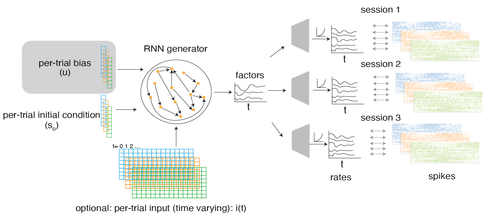

# Contextual Latent Factor Analysis via Dynamical Systems



## Overview

LFADS is a framework for learning interpretable dynamics from high-dimensional neural recordings. This implementation extends the original LFADS with a learned, **context-dependent per-trial bias** that improves interpretability by separating trial-specific variations from the underlying latent dynamical system usin.


### Paper

*Improved interpretability in LFADS models using a learned, context-dependent per-trial bias*

Nishal P. Shah, Benyamin Abramovich Krasa, Erin Kunz, Nick Hahn, Foram Kamdar, Donald Avansino, Leigh R. Hochberg, Jaimie M. Henderson, David Sussillo, bioRxiv 2025

[Paper link](https://www.biorxiv.org/content/10.1101/2025.10.03.680303v1)

### Abstract

The computation-through-dynamics perspective argues that biological neural circuits process information via the continuous evolution of their internal states. Inspired by this perspective, Latent Factor Activity using Dynamical systems (LFADS) identifies a generative model consistent with the neural activity recordings. LFADS models neural dynamics with a recurrent neural network (RNN) generator, which results in excellent fit to the data. However, it has been difficult to understand the dynamics of the LFADS generator. In this work, we show that this poor interpretability arises in part because the generator implements complex, multi-stable dynamics.

We introduce a simple modification to LFADS that ameliorates issues with interpretability by providing an inferred per-trial bias (modeled as a constant input) to the RNN generator, enabling it to contextually adapt a simpler dynamical system to individual trials. In both simulated neural recordings from pendulum oscillations and real recordings during arm movements in nonhuman primates, we observed that the standard LFADS learned complex, multi-stable dynamics, whereas the modified LFADS learned easier-to-understand contextual dynamics. This enabled direct analysis of the generator, which reproduced at a single-trial level previous results shown only through more complex analyses at the trial average. Finally, we applied the per-trial inferred bias LFADS model to human intracortical brain computer interface recordings during attempted finger movements and speech. We show that modifying neural dynamics using linear operations of the per-trial bias addresses non-stationarity and identifies the extent of behavioral variability, problems known to plague BCI. We call our modification to LFADS as "contextual LFADS".

## Installation

### Prerequisites
- Python 3.9 or higher
- Conda (Miniconda or Anaconda)

### Setup Instructions

1. **Create a new conda environment:**
```bash
conda create -n lfads python=3.9 -y
```

2. **Activate the environment:**
```bash
conda activate lfads
```

3. **Install the lfadsci package in development mode:**
```bash
pip install -e .
```

By default, this installs **TensorFlow CPU** (`tensorflow-cpu==2.7.0`).

4. **(Optional) Install with GPU TensorFlow:**
```bash
LFADSCI_GPU=1 pip install -e .
```

If you already installed the CPU version and want to switch to GPU:
```bash
pip uninstall -y tensorflow-cpu tensorflow
LFADSCI_GPU=1 pip install --force-reinstall -e .
```

This will install all required dependencies including:
- TensorFlow (CPU by default, GPU when `LFADSCI_GPU=1`)
- Hydra (configuration framework)
- Jupyter Lab and Jupyter Notebook support
- Scientific computing libraries (NumPy, SciPy, Pandas, Scikit-learn)
- Visualization tools (Seaborn, Matplotlib)
- Weights & Biases (experiment tracking)

### Verify Installation

To verify that the installation was successful:
```bash
python -c "import lfadsci; print('lfadsci successfully installed')"
```

## Preparing Data

To train LFADS models on your own data, you need to create a data loader that returns four arrays:

1. **`neural_trials`** - List of neural activity timeseries across trials. Each element is a 2D array of shape (time, neurons) containing spike counts or firing rates for a single trial.

2. **`cues_trials`** - List of task cues or conditions associated with each trial. Used only for analysis and visualization, not for model training.

3. **`delays_trials`** - List of delay periods or kinematic labels associated with each trial. Used only for analysis, not for model training.

4. **`session_trials`** - List of session IDs (integers) associated with each trial. Each trial is assigned a session ID, which switches a linear filter in both the encoder and generator during training. Only neural activity and session ID are used during model training.

**Example:** See [src/lfadsci/utils_pendulum.py](src/lfadsci/utils_pendulum.py) for a reference implementation. The pendulum dataset generator shows how to structure data for LFADS:
- It generates synthetic neural data from pendulum dynamics
- Assigns each trial a gravity condition (cue)
- Tracks session membership for model training
- Returns all four arrays in the required format

Once your data loader is ready, create a configuration file in `src/lfadsci/configs/dataset/` following the structure of existing configs (e.g., `pendulum.yaml`), specifying the data loader function and parameters.

## Pendulum simulation: train and analyze

The pendulum example generates synthetic neural data from pendulum dynamics (with varying gravity conditions), trains an LFADS model, runs fixed-point analysis, and visualizes learned latent dynamics.

Start by running the single-fit shell workflow:

```bash
bash scripts/pendulum.sh
```

Alternatively, you can fit and analyze interactively in the notebook:

```bash
jupyter lab notebooks/pendulum.ipynb
```

The notebook covers:
- data generation (`pendulum` dataset)
- model build + training
- loading cached `results_partial.pkl` / `results_full.pkl` when available or computing them within the notebook.
- fixed-point and eigenvalue analysis
- visualization of states, bias, initial conditions, and fixed points

## Hyperparameter search (Hydra)

You can also run Hydra multirun sweeps for pendulum hyperparameter search. See:

- [scripts/pendulum_parameter_sweep.sh](scripts/pendulum_parameter_sweep.sh)

### T19 finger workflow (train to `results_partial.pkl`)

To mirror the notebook workflow for T19 up to partial posterior outputs (without fixed-point analysis), run:

```bash
python3 src/lfadsci/t19_train_partial.py
```

This script:
- loads T19 `.mat` data,
- trains LFADS,
- computes posterior-sampled outputs via `compile_results`,
- writes `results_partial.pkl` under `outputDir`.

For Hydra multirun sweeps over training/model hyperparameters (including `n_steps`, `model.n_hidden_decode`, and `model.factors`), run:

```bash
bash scripts/t19_partial_parameter_sweep.sh
```

The T19 sweep script is dual-GPU aware: it launches two concurrent Hydra workers, pinned to `gpuNumber=0` and `gpuNumber=1`, and splits seeds across GPUs for better throughput.

## Multi-session training

When training on multiple sessions, the model includes a session-specific linear filter in the generator that transforms the latent factors for each session. Additionally, the learned bias can differ across trials. This means session-specific differences can be absorbed by either the session-specific linear filter or the per-trial bias term.

**Important for analysis:** You must be careful when interpreting multi-session models. You cannot directly compare biases across sessions to understand session differences, since those differences could be encoded in the session-specific linear filter instead. 

**Valid analyses within a session:** You can safely compare per-trial biases across conditions *within the same session* to understand how the latent dynamics differ for different task conditions. This analysis is valid because the session-specific filter is constant within a session.

**Across-session comparisons:** For comparing activity or dynamics across sessions, examine the latent factors and dynamics directly (e.g., fixed points, eigenvalues) rather than relying on bias alone.


